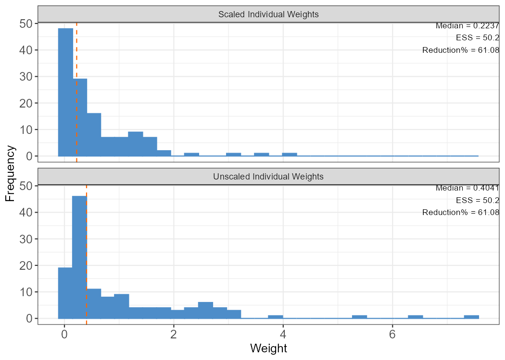
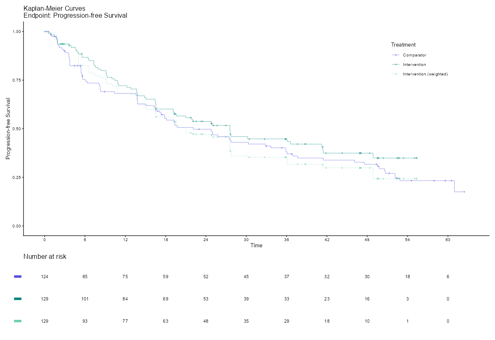

## From MAIC to maicplus: a brief history

```{mermaid}
timeline
    title R packages for MAIC: from MAIC to maicplus
    2021 : Roche + BresMed release the open-source "MAIC" R package v0.1.0 (Bennett, Gregory, Smith, Birnie)
    2022 : Independent "maic" (R. Young, CRAN) and "maicChecks" (Yau & Glimm, CRAN) packages published
    2023 : MSD and Roche launch "maicplus" under a new, vendor-neutral GitHub org (hta-pharma); announced via ISPOR SA83 abstract
    2024-25 : "maicplus" reaches CRAN; Roche archives "MAIC", pointing users to maicplus
    2025 : Independent study confirms maic / MAIC / maicplus reproduce identical NICE TSD 18 results
```

## MAIC analyses in the biostatistics department (2024–2026)

| Year | Comparison | Endpoints | Tooling & practice |
|---|---|---|---|
| 2024 | r/r MCL: Intervention (pooled Pivotal A+B) vs Comparator (published single-arm) | PFS (pooled and per-study), TEAE, lab parameters | `MAIC` (Roche) package |
| 2025 | CLL/SLL: Intervention (Phase 3 study) vs Comparator (Ibru) | PFS, OS, TEAE | `MAIC` (Roche) package; validation runs |
| 2026 | r/r MCL: Intervention (Pivotal A+B) vs Comparator (ACE-LY-004) | ORR/CRR, PFS/OS, TEAE | `maicplus` package (this deck) |

All three projects are **unanchored MAIC**: individual patient data from our
own studies re-weighted to match the published aggregate data of a comparator
trial, with PFS/OS and safety as the recurring endpoints.

## How our MAIC practice has evolved

- **2024 — first project (r/r MCL)**: PFS analysed pooled and per-study
  (Pivotal A/B), plus treatment-emergent AEs and lab parameters; built directly on 
  the original `MAIC` package
- **2025 — broader scope**: a second comparison (Phase 3 study vs. Ibru) adding OS 
  alongside PFS and TEAE; introduced **validation runs** of the analysis code
- **2026 — current case study**: the full pipeline in this deck — binary
  (ORR/CRR), time-to-event (PFS/OS) and safety — on `maicplus`, with ESS
  falling 129 → 50.2 after weighting
- Tooling and practice have matured across the three years: hand-coded `MAIC`
  scripts → `maicplus` workflows, plus reproducibility practices (logrx audit
  logs, RTF reporting, renv planned)

## Introducing the `maicplus` package

- Open-source R package jointly maintained by MSD and Roche, implementing the
  MAIC workflow proposed by Signorovitch (2012)
- Published on CRAN; GitHub: `hta-pharma/maicplus`
- Supports two endpoint types: **time-to-event** and **binary**
- Covers the full pipeline: data preprocessing, weight estimation, diagnostics,
  and result reporting

```{r}
#| eval: false
#| echo: true
install.packages("maicplus")
library(maicplus)
```

## Core functions at a glance

| Stage | Function | Purpose |
|---|---|---|
| Preprocessing | `process_agd()`, `dummize_ipd()` | Prepare aggregate data / create dummy variables |
| Centering | `center_ipd()` | Center IPD covariates using AgD means |
| Weight estimation | `estimate_weights()` | Solve logistic weights via method of moments |
| Diagnostics | `check_weights()`, `plot_weights_ggplot()` | Effective sample size (ESS), weight distribution |
| Analysis | `maic_anchored()`, `maic_unanchored()` | Weighted survival/binary comparison |
| Visualization | `kmplot()`, `kmplot2()`, `basic_kmplot()` | KM curves before/after weighting |

## End-to-end workflow

```{mermaid}
%%{init: {"themeVariables": {"fontSize": "32px"}, "flowchart": {"nodeSpacing": 30, "rankSpacing": 40}}}%%
flowchart LR
    A[IPD: individual<br/>patient data] --> B[Center covariates:<br/>center_ipd]
    C[AgD: published<br/>aggregate data] --> B
    B --> D[Estimate weights:<br/>estimate_weights]
    D --> E[Check weights / ESS]
    E --> F[Weighted analysis:<br/>maic_anchored /<br/>maic_unanchored]
    F --> G[Survival or<br/>binary results]
```

## Preprocessing & weight calculation

The matching step needs IPD and AgD in a common format. `maicplus` provides:

- `process_agd(raw_agd)` — convert published aggregate data (counts / proportions per covariate) into the wide format used downstream
- `dummize_ipd(raw_ipd, dummize_cols, dummize_ref_level)` — create dummy variables for categorical IPD covariates
- `center_ipd(ipd, agd)` — center IPD covariates on the AgD means, so the matching target becomes 0
- `estimate_weights(data, centered_colnames, ...)` — solve the logistic weights by the method of moments (`BFGS` optimizer by default)

Weight diagnostics:

- `check_weights(weighted_data, processed_agd)` — confirm the weighted IPD means match the AgD target
- `plot_weights_ggplot(weighted_data, bin_col, vline_col, main_title, bins)` — histogram of individual weights with ESS

```{r}
#| eval: false
#| echo: true
agd          <- process_agd(raw_agd)
ipd_dummy    <- dummize_ipd(raw_ipd, dummize_cols, dummize_ref_level)
ipd_centered <- center_ipd(ipd_dummy, agd)
weighted     <- estimate_weights(ipd_centered, centered_colnames)
```

## Binary analysis

Weighted binary endpoints (e.g. ORR, CRR) are compared with
`maic_anchored()` / `maic_unanchored()` using `endpoint_type = "binary"`:

- Effect measures: **OR**, **RR**, **RD**; confidence intervals via bootstrap
  (`boot_ci_type`) or robust covariance (`binary_robust_cov_type = "HC3"`)
- The comparator arm enters as pseudo-IPD — `get_pseudo_ipd_binary()`
  reconstructs it from aggregated counts
- `maic_anchored()` additionally takes `trt_common` for the shared
  comparator arm

```{r}
#| eval: false
#| echo: true
result_orr <- maic_unanchored(
  weights_object = weighted, ipd = adrs, pseudo_ipd = pseudo_ipd,
  trt_ipd = "Intervention", trt_agd = "Comparator",
  endpoint_type = "binary", eff_measure = "OR"
)
```

## Survival analysis

Weighted time-to-event endpoints (e.g. PFS, OS) use `endpoint_type = "tte"`:

- Reports the weighted **HR** (and median survival) with confidence interval;
  `time_scale` controls the time unit
- `kmplot()` / `kmplot2()` — KM curves for weighted vs. unweighted IPD against
  the comparator pseudo-IPD, with number-at-risk tables
- `basic_kmplot()` — plain ggplot KM helper

```{r}
#| eval: false
#| echo: true
result_pfs <- maic_unanchored(
  weights_object = weighted, ipd = adtte, pseudo_ipd = pseudo_ipd,
  trt_ipd = "Intervention", trt_agd = "Comparator",
  endpoint_type = "tte", eff_measure = "HR", time_scale = "month"
)
```

## Toy example: package syntax

Before the real case study, a quick look at the syntax using `maicplus`'s
built-in demo data:

```{r}
#| eval: true
#| echo: true
library(maicplus)
data("adsl_sat")       # IPD baseline data (trial A)
data("adtte_sat")      # IPD survival data (trial A)
data("pseudo_ipd_sat") # Pseudo IPD reconstructed from AgD (trial B, digitized KM)
str(adsl_sat[, 1:6])
```

```{r}
#| eval: false
#| echo: true
ipd_centered <- center_ipd(ipd = ipd, agd = agd)
weighted <- estimate_weights(data = ipd_centered, centered_colnames = centered_colnames)
result <- maic_unanchored(
  weights_object = weighted, ipd = adtte_sat, pseudo_ipd = pseudo_ipd_sat,
  trt_ipd = "A", trt_agd = "B", endpoint_type = "tte", eff_measure = "HR"
)
```

Same four calls — `center_ipd()` → `estimate_weights()` → `maic_unanchored()` /
`maic_anchored()` — drive the real production analysis on the next slides.

---

<div class="appendix-title-container">
  <div class="appendix-title">Case study: An unanchored MAIC in relapsed/refractory mantle cell lymphoma</div>
</div>

## Background

- **Intervention (IPD)**: pooled studies **Pivotal A + Pivotal B**,
  full analysis set N = **129**, individual patient data available
- **Comparator (AgD)**: trial **ACE-LY-004**, N = **124**,
  only published aggregate results available
- **Indication**: relapsed/refractory mantle cell lymphoma (r/r MCL)
- **Design**: **unanchored MAIC** — no shared comparator arm between the two trials

Endpoints assessed: ORR, CRR (binary), PFS, OS (time-to-event), and
treatment-emergent adverse events (safety)

## Matching variables

16 baseline covariates, chosen to reflect prognostic factors/effect modifiers
reported for ACE-LY-004, were derived from ADaM (`ADSL`) and centered on the
comparator's published proportions:

| Domain | Covariates |
|---|---|
| Demographics | Age ≥ 65, Sex: male |
| Disease severity | ECOG PS > 1, Refractory disease, LDH > ULN, Stage III/IV, Tumour bulk ≥ 5cm, Bone marrow involvement, sMIPI risk (low / intermediate) |
| Treatment history | Prior lines ≥ 2, prior rituximab, prior SCT, prior bendamustine, prior bortezomib, prior lenalidomide |

```{r}
#| eval: false
#| echo: true
base_list <- list(
  AGECAT   = list(label = "Age >=65", count = 80),
  SEX_MALE = list(label = "Sex: male", count = 99),
  ECOG_G1  = list(label = "ECOG PS: >1", count = 9),
  # ... 13 more covariates, each with the AgD responder count
  LENALIDOMIDE = list(label = "Prior Lenalidomide", count = 9)
)
# AgD proportions built from base_list$count / comparator_total (124)
agd <- as.data.frame(c(list(N = 124, ARM = "Comparator"),
  setNames(lapply(base_list, \(x) x$count / 124), paste0(names(base_list), "_PROP"))))
```

## Weight estimation & effective sample size

```{r}
#| eval: false
#| echo: true
ipd_centered <- center_ipd(ipd = ipd, agd = agd)

weighted_sat <- estimate_weights(
  data = ipd_centered,
  centered_colnames = paste0(names(base_list), "_CENTERED")
)
weighted_sat$ess
```

| Metric | Value |
|---|---|
| IPD sample size (N) | 129 |
| Effective sample size (ESS) after weighting | **50.2** |
| ESS reduction | **61%** |

An ESS reduction this large signals fairly limited overlap between the two
populations on the 16 matching covariates — post-weighting estimates should be
interpreted with wider uncertainty than the nominal N = 129 would suggest.

## Weight diagnostics

```{r}
#| eval: false
#| echo: true
plot_weights_ggplot(weighted_sat,
  bin_col = "#4d8dc9", vline_col = "#FF6600",
  main_title = c("Scaled Individual Weights", "Unscaled Individual Weights"),
  bins = 30
)
```

{fig-align="center" height="480"}

A right-skewed weight distribution with a handful of large weights is
consistent with the ESS drop above — a small number of intervention patients
are doing most of the work to reproduce the ACE-LY-004 population profile.

## Covariate balance before/after weighting

Largest imbalances between unweighted intervention IPD and the comparator
target (`check_weights()`); after weighting, every covariate matches the AgD
proportion exactly (method-of-moments guarantee):

| Covariate | Intervention (unweighted) | Comparator (target) | Gap |
|---|---|---|---|
| Age ≥ 65 | 37.2% | 64.5% | 27.3pp |
| Prior bortezomib | 5.4% | 19.4% | 13.9pp |
| Prior lines ≥ 2 | 42.6% | 52.4% | 9.8pp |
| sMIPI low risk | 48.1% | 38.7% | 9.4pp |
| Bone marrow involvement | 44.2% | 50.0% | 5.8pp |
| Prior lenalidomide | 13.2% | 7.3% | 5.9pp |
| ECOG PS > 1 | 1.6% | 7.3% | 5.7pp |

::: aside
Remaining 9 covariates were within ~3pp before weighting; full table in `t-1-baseline.rtf`
:::

## Binary endpoints: ORR and CRR

Unanchored comparison via `maic_unanchored(..., endpoint_type = "binary")`:

| Endpoint | Arm | Before matching | After matching |
|---|---|---|---|
| **ORR** | Intervention | 82.2% (106/129) | 76.9% (ESS-scaled) |
| | Comparator | 81.5% (101/124) | 81.5% |
| | **OR (95% CI)** | 1.05 (0.55, 1.99), p = 0.88 | 0.76 (0.31, 1.89), p = 0.55 |
| **CRR** | Intervention | 38.8% (50/129) | 36.6% (ESS-scaled) |
| | Comparator | 47.6% (59/124) | 47.6% |
| | **OR (95% CI)** | 0.70 (0.42, 1.15), p = 0.16 | 0.64 (0.32, 1.26), p = 0.20 |

No statistically significant difference in ORR or CRR, before or after
adjustment; risk differences (also computed via `eff_measure = "RD"`) tell the
same story (e.g. CRR: −8.8pp unadjusted, −11.0pp adjusted, both p > 0.15).

## Survival endpoints: PFS and OS

```{r}
#| eval: false
#| echo: true
result_pfs <- maic_unanchored(
  weights_object = weighted_sat, ipd = adtte_pfs, pseudo_ipd = pseudo_ipd_pfs,
  trt_ipd = "Intervention", trt_agd = "Comparator", normalize_weight = TRUE,
  endpoint_type = "tte", eff_measure = "HR", time_scale = "month"
)
```

| Endpoint | Median (months) Intervention / Comparator | HR (95% CI), p-value |
|---|---|---|
| PFS — before matching | 27.6 / 22.1 | 0.83 (0.60, 1.14), p = 0.25 |
| PFS — after matching | 21.0 / 22.1 | 1.03 (0.70, 1.52), p = 0.88 |
| OS — before matching | NR / 59.2 | 0.88 (0.60, 1.29), p = 0.51 |
| OS — after matching | 49.1 / 59.2 | 1.21 (0.74, 1.96), p = 0.45 |

The unadjusted comparison numerically favored the intervention on both PFS and OS;
after adjusting for the 16 baseline covariates, both hazard ratios move toward
(PFS) or past (OS) 1 and are not statistically significant — baseline imbalance
was masking (not creating) an apparent advantage. OS is also still immature.

## PFS Kaplan-Meier curves

```{r}
#| eval: false
#| echo: true
kmplot2(
  weights_object = weighted_sat, tte_ipd = adtte_pfs, tte_pseudo_ipd = pseudo_ipd_pfs,
  trt_ipd = "Intervention", trt_agd = "Comparator", normalize_weights = TRUE,
  endpoint_name = "Progression-free Survival", time_scale = "month", censor = TRUE
)
```

{fig-align="center" height="480"}

The weighted intervention curve (light green) sits close to the unweighted
curve (dark green) through mid-follow-up, then tracks slightly below the
comparator curve (purple) — consistent with the HR crossing 1 after weighting.

## Safety: treatment-emergent adverse events

Comparator safety data (26 AE terms, from `acala_ae.csv`) analyzed with the
same unanchored binary workflow, looped per term in `maic-t4-ae.R`:

| AE category | Comparator (AgD) | Intervention (unweighted) | OR (unweighted) |
|---|---|---|---|
| Any TEAE | 87.1% (108/124) | 90.7% (117/129) | 1.44 (0.65, 3.19), p = 0.36 |
| TEAE grade ≥ 3 | 66.1% (82/124) | — | — |
| SAE | 50.0% (62/124) | — | — |
| Headache | 38.7% (48/124) | — | — |
| Diarrhoea | 37.9% (47/124) | — | — |

No individual AE term showed a statistically significant difference; full
per-term OR/RD (before and after weighting) reported in `t-4-ae.rtf`.

## Reproducibility & engineering practices

This project follows a modular, auditable analysis structure:

```
maic-start.R          → data prep, centering, weight estimation (shared)
maic-t1-baseline.R    → Table 1: covariate balance before/after
maic-t2-binary.R      → Table 2: ORR/CRR (OR, RD)
maic-t3-survival.R    → Table 3: PFS/OS (HR, medians)
maic-t4-ae.R          → Table 4: TEAE loop (OR, RD per term)
maic-f1/f2-km-*.R     → Figures: PFS/OS KM curves (kmplot2)
maic-batch-with-log.R → batch runner with logrx audit logs
```

Each table/figure script `source()`s the shared `maic-start.R` setup, so one
weighting model feeds every downstream output. Two `pharmaverse`-style
packages handle the "last mile": **`officer` + `flextable`** for submission-
ready RTF tables/figures, and **`logrx`** for execution audit logs.

## Environment management with `renv`

`logrx` records *which* package versions ran; it doesn't guarantee those exact
versions can be reinstalled later. **`renv`** closes that gap with a
project-local library and lockfile:

```{r}
#| eval: false
#| echo: true
renv::init()      # creates renv/ + .Rprofile; project gets its own library
# ... install/update packages as usual (install.packages(), etc.) ...
renv::snapshot()  # records exact package + version graph into renv.lock
renv::restore()   # on another machine/CI: recreates the identical library
```

- `renv.lock` is a JSON file listing every package and exact version used by
  the project — check it into version control alongside the `.R` scripts
- `renv::restore()` lets a new analyst (or a validation/QC environment)
  reproduce the *identical* library that produced a given `t-1-baseline.rtf`,
  not just a same-named-but-possibly-newer set of packages
- Pairs naturally with `logrx`: `renv.lock` **pins** the environment going
  forward, while each `logrx` log **documents** what actually ran for one
  execution — together they cover both "can I rebuild this environment?" and
  "what exactly happened when this output was produced?"

::: aside
This project currently pins package versions informally (fixed R version,
logged sessionInfo per run via `logrx`) but does not yet have a `renv.lock` —
adding `renv::init()` + `renv::snapshot()` would let the whole `acala/`
pipeline be restored on a new machine with one command
:::

## renv in the R pilot submission

The R Consortium **R Submissions Working Group** runs FDA submission pilots to
test whether R-based regulatory submissions are reproducible and reviewable.
**Pilot 3** (submitted to FDA Aug 2023, re-submitted Apr 2024) generated the
ADaMs and TLFs entirely in R, and made the R environment part of the
submission using **`{renv}`**:

- Open-source packages and the pilot's proprietary R package (installed from
  git) were captured in a `renv.lock` via `renv::snapshot()`
- The `renv.lock` was included in Module 5 of the eCTD package alongside the
  analysis programs, so reviewers could rebuild the exact environment with
  `renv::restore()` and re-run the analyses
- Reproducing the environment was an explicit evaluation criterion: FDA staff
  reproduced the results by restoring the R environment and retrieving both
  open-source and proprietary packages

References:

- <https://rconsortium.github.io/submissions-wg/pilot3.html>
- <https://github.com/RConsortium/submissions-pilot3-adam-to-fda>

This is the same `renv` + lockfile practice our project follows (and the
`acala/` pipeline should adopt next).

## RTF reporting with `officer` + `flextable`

Every table script builds a `flextable`, then wraps it with a study-standard
header/footer via `officer::block_list()` before writing to RTF:

```{r}
#| eval: false
#| echo: true
table1 <- base_table |>
  flextable() |>
  set_header_labels(label = " ",
    internal_trial = paste0(intervention_header, " \n N=", nrow(ipd), " \n n (%)"),
    external_trial = paste0(comparator_header, " \n N=", comparator_total, " \n n (%)"),
    pval1 = "p-value") |>
  add_header_row(values = c(" ", "Without adjustment", "After adjustment"),
                  colwidths = c(1, 3, 3)) |>
  autofit() |>
  align(j = 2:7, align = "center", part = "all")
```

```{r}
#| eval: false
#| echo: true
header_default <- block_list(
  fpar(ftext(headL1, fp_text(font.size = 9))),                 # sponsor name
  fpar(ftext(headL2, fp_text(font.size = 9)),
       ftext("Page ", fp_text(font.size = 9)), run_word_field(field = "PAGE"),
       ftext(" of ", fp_text(font.size = 9)), run_word_field(field = "NUMPAGES")),
  fpar(ftext("Table 1. Baseline characteristics ...", fp_text(font.size = 9)))
)

footer_default <- block_list(
  fpar(ftext(paste0("Note: ESS after adjustment is ", round(weighted_sat$ess, 2), "."),
             fp_text(font.size = 9))),
  fpar(ftext(paste0("Program Name: ", program), fp_text(font.size = 9)),
       ftext(R.version.string, fp_text(font.size = 9)))
)

sect_properties <- prop_section(
  page_size(orient = "landscape"),
  header_default = header_default, footer_default = footer_default
)

save_as_rtf(table1, path = file.path(path$outpath, outname), pr_section = sect_properties)
```

- `set_header_labels()` / `add_header_row()` build the "Without adjustment" vs.
  "After adjustment" column groups seen in Tables 1–4
- `header_default` / `footer_default` are reused **verbatim** across all
  table/figure scripts — sponsor name, page numbering, program name, R
  version, and generation timestamp always appear in the same place
- Figures use the same pattern via `officer::rtf_doc()` / `rtf_add()`
  (`maic-f1-km-pfs.R`), embedding the `kmplot2()` + risk-table `patchwork` object

## Reproducibility logging with `logrx`

```{r}
#| eval: false
#| echo: true
# maic-batch-with-log.R
options(verbose = TRUE)

logrx::axecute("maic-t1-baseline.R")  # Table 1: baseline characteristics
logrx::axecute("maic-t2-binary.R")    # Table 2: ORR/CRR
logrx::axecute("maic-t3-survival.R")  # Table 3: PFS/OS (HR)
logrx::axecute("maic-f1-km-pfs.R")    # Figure 1: PFS KM plot
logrx::axecute("maic-f2-km-os.R")     # Figure 2: OS KM plot
logrx::axecute("maic-t4-ae.R")        # Table 4: adverse events
```

`logrx::axecute()` runs a script and writes a companion `<script>.log` file
(here `maic-t1-baseline.log`, ~40 KB) capturing:

| Log section | Contents |
|---|---|
| Metadata | `logrx` version, CRAN build info |
| User & file info | user, file path, SHA-1 hash of the script |
| Session info | R version, OS, locale, **every attached package + version** |
| Expression trace | each top-level R expression, in execution order |
| Result | the script's final `save_as_rtf()` return value (output path) |

This gives a per-output audit trail — who ran what code, against which script
hash and package versions, producing which file — without hand-written change
logs. `Batchrun_R.bat` provides a non-interactive (`Rscript.exe`) alternative
for scheduled/CI-style batch runs.

## Practical considerations

- **Code flexibly for baseline adjustment**: write the analysis scripts so the
  matching-covariate list and other baseline settings can be changed without
  rewriting the pipeline
- **Discuss ESS early at dry run**: once the effective sample size after
  weighting is available, raise it with the statistician promptly — a large
  ESS drop is a key signal about population overlap and estimate stability
- **Choose R and package versions with caution, and reproduce across
  environments**: pin the R version and R package versions (e.g. a `renv`
  lockfile) and re-run the analysis in multiple terminals/environments to
  confirm the results are reproducible

## Further reading

- `vignette("introduction", package = "maicplus")`
- `vignette("calculating_weights", package = "maicplus")`
- `vignette("anchored_survival")` / `vignette("unanchored_survival")` / `*_binary`
- GitHub: <https://github.com/hta-pharma/maicplus/>
- [logrx](https://pharmaverse.github.io/logrx/)
- [Clinical Reports with R](https://statprogworkshop.onrender.com/Clinical%20Report%20with%20R/Clinical_Report_With_R.html)

# Thanks {.end-slide}

{.absolute top=200 left=330 width="400" height="320"}
